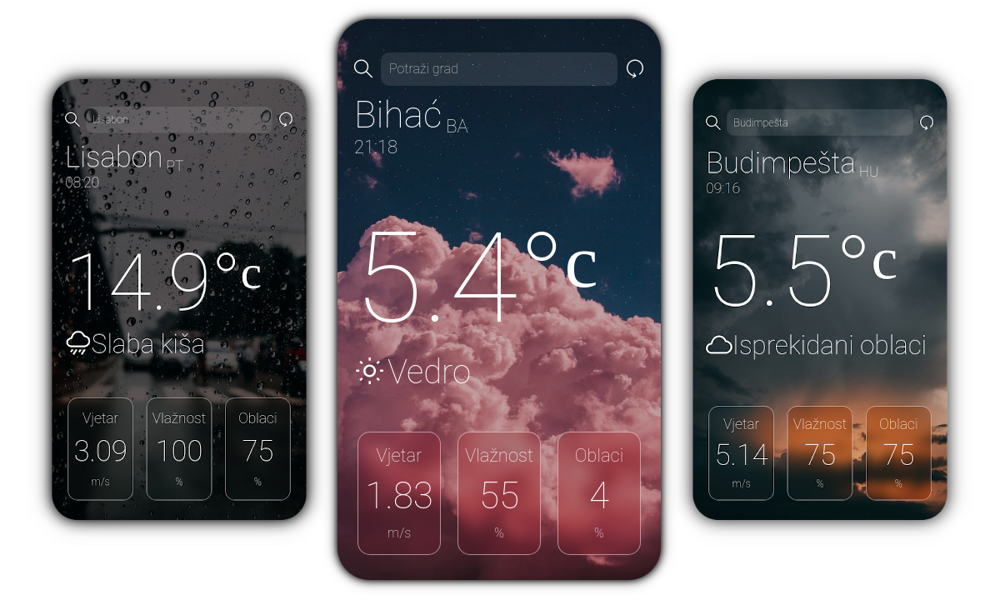

<h1 align='center'>Vedr</h1>
<h2 align='center'>Trenutno vrijeme, bilo gdje.</h2>

# O aplikaciji
**Vedr** je mobilna aplikacija za Android i iOS uređaje koja elegantno prikazuje meteorološke informacije o odabranom gradu. U zavisnosti od meteorološkog stanja i trenutnog vremena, **Vedr** prikazuje i prikladnu pozadinsku sliku.
## Korištenje
Pri pokretanju aplikacije, bit će prikazano vrijeme trenutne lokacije uređanja (koja je bazirana na IP adresi uređaja).

Lokacija se može pretražiti koristeći ime grada neovisno o jeziku, npr. `Beč`, `Vienna`, `Wien` ili koristeći ime grada i internacionalog koda države, npr. `Venice,US` i `Venice,IT`.

Za korištenje aplikacije je nužna internet veza.

# Tehničke informacije
**Vedr** je razvijena koristeći **React Native** framework uz **Expo** platformu. Informacije o trenutnom vremenu u odabranom gradu se dobijaju koristeći **OpenWeatherMap API**.